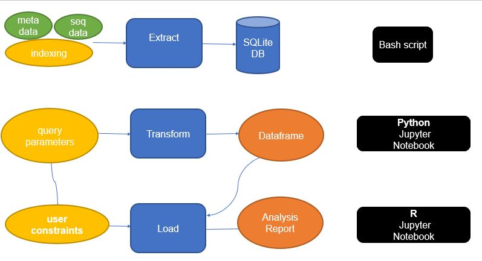
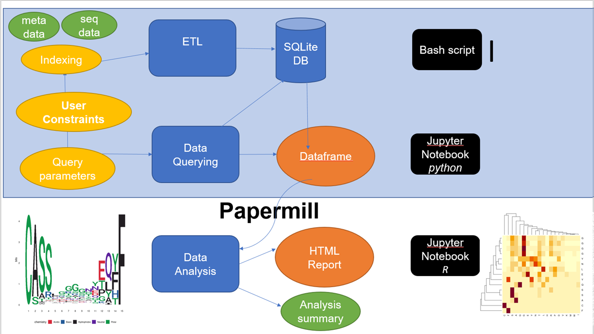

# precisionFDA_Covid19_repo

Data mining of clinical associations from bioinformatics analysis of immunological data 

By Dr. Mahmoud Shobair and Gerald Parker

***

The tool which we have created is designed to handle these functions:

- Takes data from supplied CSV and converts into a SQLite DB
- Takes the SQLite DB and allows the user to clean ahd select relevant data for hypothesis testing to use into a CSV or SQLite DB.
- Allows the user to load the transformed data to perform exploratory data analysis (EDA). An example use case of data visualization is presented in an R-notebook comparing protein sequence data between subjects grouped by disease_stage clinical variable.

This document will be broken down into each portion of the traditional ETL model in seperate sections.

***
Here is an overview of the workflow.



## Setting up dependencies and virtual environment
App development and testing was done primarily in Ubuntu 20.04/18.04.

<!-- GP - Edited to remove unneeded dependencies -->
### Install ubuntu dependencies:
```sh
sudo apt install -y curl sqlite3 pipenv jupyter-client r-base-core libgsl-dev libcurl4-openssl-dev git libxml2-dev

```
<!-- GP - Edited to add "R" and further show what to do when done with step-->
### Install R packages
```R
R (opens R environment)
install.packages(c("IRkernel", "data.table", "RSQLite", "sqldf", "BiocManager", "yaml")) 
(Answer "yes" twice)
library(IRkernel)
IRkernel::installspec()
library(BiocManager)
BiocManager::install("universalmotif")
BiocManager::install("MotifDb")

(Ctrl + D to Exit Environment)
(Answer "No" to saving workspace)
```

### Download, extract the zipped repo source 
Make certain you are not in "/" when running this.
```sh
git clone --branch papermill https://github.com/mshobair/precisionFDA_Covid19_repo.git 
cd precisionFDA_Covid19_repo
```
<!-- GP - Edited to clarify script can be edited to point to one's own dataset but that this will just work without an edit -->
## Creating and indexing SQLite database (E in ETL)
This script can  be edited to point to your own datafile but can be ran as is with the demonstration data.
```sh
cd extract_to_sql/
# change input table paths to their local paths
sh ./create_sqlitedb.sh ./seqtable_test.tsv ./metadata_test.tsv
```
<!-- GP - Edited to state Pipfile issue that comes up between differing versions of Python -->
### Activating python virtual environment to launch juypyter notebook
You will need to edit the Pipfile with the version of Python in use before running.
```sh
cd ../
pipenv install
pipenv run jupyter notebook
```
<!-- GP - Edited to clarify information in the parentheses pertains to the demonstration data -->
## Run Data Cleaning and Filtering Notebook (T in ETL)
- Open sql_to_csv_all_subject.ipynb
 - In cell 4, change path of SQLite database file to point to the local path
 - In cell 6, change path of metadata.csv to point to local path
- Open papermill.ipynb
 - Click the fast forward button (kernal restart and run all cells)
 - This will generate a junction_aa motif matrix for each record of subject_id
 *( In the output directory)

- Adjust values in cells 4-5 to select two disease_stage groups (e.g. "Recovered" and "Baseline" or "Baseline" and "Acute")
- Adjust value in cell 6 for the number of records queried ( ~1000000 records per subject on average)
- Run all notebook cells by seleting from Cell menu "Run All"

*The output will be a SQLite database (or flatfile if user so chooses) to be loaded into analysis notebook: MotifVisualizationR.ipynb* 

 ## Run Data Analysis Notebook (L in ETL)
 - Open MotifVisualizationR.ipynb from the open Jupyter Notebook server webpage
 - Adjust value in cell 4 to select the length of junction_aa for motif visualization and hypothesis testing.
 - Run all notebook cells by seleting from Cell menu "Run All"
 - HTML output can be downloaded by selecting File -> Download as -> HTML




