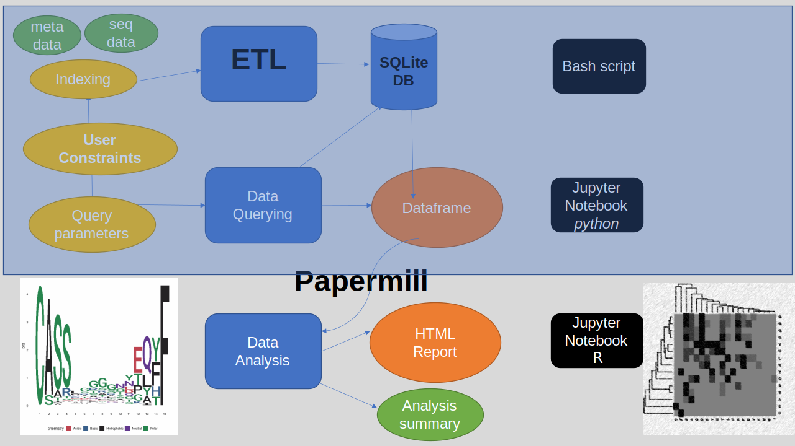

# precisionFDA_Covid19_repo

Data mining of clinical associations from bioinformatics analysis of immunological data 

By Dr. Mahmoud Shobair and Gerald Parker

***
When scoping for this project we wanted to make this as flexible, extensible, and modular as possible while still fulfilling the requirements of the challenge.  This caused us to create more of an ETL/EDA hybrid solution which can be used both to manage, clean, and manipulate data as well as run exploratory queries and calculations while creating visualizations which refer to said queries and calculations.

***

Our primary goals for this competition:

  - Create a standardizable ETL/EDA framework using readily available toolsets
    - The thought is that with standardization comes regularity in the ETL/EDA processes across various disciplines  
  - Create modularity between each stage of any and all ETL/EDA modules within the framework
    - This allows us to easily modify the data pipeline at any point in the chain
    - This flexibility enables users to adapt this framework for many different types of data management/analysis use cases
  - Generate a real-world use within this flexible framework that shows off the modularity and flexibility
    - We used the provided data and stayed within the context of the Challenge.
    - Creating an easily reproducible way of collapsing large datasets
    - Begin exploring the identification of associations within the provided dataset between clinical factors and adaptive immunological features
    - Show examples of the explored associations using visualizations and showing the logic behind how these associations/visualizations were generated

***
Here is an overview of the workflow.



## Setting up dependencies and virtual environment
App development and testing was done primarily in Ubuntu 20.04/18.04.

<!-- GP - Edited to remove unneeded dependencies -->
### Install ubuntu dependencies:
```sh
sudo apt install -y curl sqlite3 pipenv jupyter-client r-base-core libgsl-dev libcurl4-openssl-dev git libxml2-dev

```
<!-- GP - Edited to add "R" and further show what to do when done with step-->
### Install R packages
```R
R (opens R environment)
install.packages(c("IRkernel", "data.table", "RSQLite", "sqldf", "BiocManager", "yaml")) 
(Answer "yes" twice)
library(IRkernel)
IRkernel::installspec()
library(BiocManager)
BiocManager::install("universalmotif")
BiocManager::install("MotifDb")

(Ctrl + D to Exit Environment)
(Answer "No" to saving workspace)
```

### Download, extract the zipped repo source 
Make certain you are not in "/" when running this.
```sh
git clone --branch datapipeline https://github.com/mshobair/precisionFDA_Covid19_repo.git 
cd precisionFDA_Covid19_repo
```
<!-- GP - Edited to clarify script can be edited to point to one's own dataset but that this will just work without an edit -->

If you are interested in end-to-end pipelining of your data, then start by following the Extraction step. Otherwise, the data visualization module can be investigated using processed sequence motif data in the "output" folder.
## Creating and indexing SQLite database (E in ETL)
This script can  be edited to point to your own datafile but can be run as is with the demonstration data. 
Indexing can take time, however the queries are very fast with minor optimizations.
```sh
cd extract_to_sql/
# change input table paths to their local paths
sh ./create_sqlitedb.sh ./seqtable_test.tsv ./metadata_test.tsv
```
<!-- GP - Edited to state Pipfile issue that comes up between differing versions of Python -->
### Activating python virtual environment to launch juypyter notebook
You will need to edit the Pipfile with the version of Python in use before running.
```sh
cd ../
pipenv install
pipenv run jupyter notebook
```
<!-- GP - Edited to clarify information in the parentheses pertains to the demonstration data -->
## Run data  quereing, cleaning and segmenting notebooks (T in ETL)
### Quering
- Open "notebooks/sql_to_csv_all_subject.ipynb"
 - In cell 4, change path of SQLite database file to point to the local path
 - In cell 6, change path of metadata.csv to point to local path
### Papermill pipeline
- Open papermill.ipynb
 - Adjust the first line of the second cell ....(N, 0, -1) to select the first N subject_ids
 - Click the fast forward button (kernal restart and run all cells)
 - This will generate a junction_aa motif matrix for each record of subject_id using the "csv_to_matrix.ipynb"
 *( In the output directory; this will take time as it is CPU-bound)
 Processed motif data is available in the output folder for Exploratory Data Analysis (EDA)

**Due to the single threaded nature of running within a non-parallelized Python/R environment (Jupyter Notebook) some modules can become CPU bound.  It is anticipated that we would spread the modules out to separate containers/nodes in order to improve overall performance.** 
 ### Run data loading and analysis Notebook (L in ETL)
 - Open "matrix_to_motif_viz.ipynb" from the open Jupyter Notebook server webpage
 - Adjust value (200) in cell 4 to select the number of subject_ids for motif visualization and hypothesis testing
 - Run all notebook cells by seleting from Cell menu "Run All"
 - HTML output can be downloaded by selecting File -> Download as -> HTML


